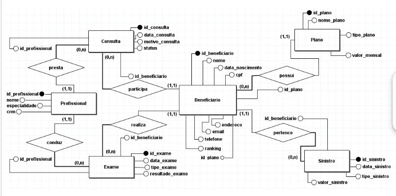

# ByteRisk - Sistema de Redução de Sinistros Odontológicos

## 3.1 Nome da Aplicação

**ByteRisk** - Sistema de Classificação e Redução de Sinistros Odontológicos

## 3.2 Apresentação dos Integrantes do Grupo

- **Gustavo Rabelo Frere**: Desenvolvedor backend, responsável pela implementação da lógica de negócio em **Java com Spring Boot**, integração com **Oracle Database**, e design de API REST.
- **Felipe Arcanjo Matos dos Anjos**: Responsável pela documentação e testes de integração usando **Postman**.
- **Marcelo Vieira Junior**: Responsável pela modelagem do banco de dados e pela criação dos diagramas (ER e Diagrama de Classes).

## 3.3 Instrução de Como Rodar a Aplicação

### Pré-requisitos

- **Java 17**
- **Maven**
- **Docker e Docker Compose**
- **Oracle Database** (ou uma instância na nuvem)

### Passos para execução

1. Clone o repositório:
   ```bash
   git clone https://github.com/usuario/repo.git
   cd repo
   
2. Instale as dependências e compile o projeto:
   ```bash
   mvn clean install
   ```
   
3. Configure as credenciais de acesso ao banco de dados no arquivo application.properties.

4. Para rodar a aplicação, usando Docker Compose:
   ```bash
    docker-compose up -d
   ```
5. Acesse a documentação da API no Swagger:
    ```
    http://localhost:8080/swagger-ui.html
    ```
   
### Configuração do Banco de Dados

# Configurações do datasource Oracle
- spring.datasource.url=jdbc:oracle:thin:@oracle.fiap.com.br:1521:orcl
- spring.datasource.username=rm553326
- spring.datasource.password=091003
- spring.datasource.driver-class-name=oracle.jdbc.OracleDriver

# Configurações do JPA e Hibernate

- spring.jpa.hibernate.ddl-auto=create
- spring.jpa.database-platform=org.hibernate.dialect.OracleDialect
- spring.jpa.show-sql=true

# Habilita o console do H2 (se for necessário para testes locais)
- spring.h2.console.enabled=true
## 3.4 Dockerfile
   ```
   # Dockerfile
   FROM openjdk:17-slim
   WORKDIR /app
   COPY target/byterisk-0.0.1-SNAPSHOT.jar app.jar
   ENTRYPOINT ["java", "-jar", "app.jar"]

   ```   
## 3.5 docker-compose.yml
    ```
      services:
         app:
            build:
               context: .
               dockerfile: Dockerfile
            ports:
               - "8080:8080"  # mapeia a porta 8080 do container para a porta 8080 da máquina host
            environment:
               - SPRING_PROFILES_ACTIVE=prod  # ajuste conforme necessário

      ```
## 3.6 Imagens dos Diagramas

### Diagrama de Classes

### Diagrama ER

### Diagrama de Entidade e Relacionamento

## 3.7 Link para o Vídeo de Apresentação

[Link para o vídeo de apresentação](https://youtu.be/3RSNVQ6kvew)

## 3.8 Listagem de Todos os Endpoints (Documentação da API)

### Beneficiário
- `POST /beneficiarios`: Criar novo beneficiário
- `GET /beneficiarios/{id}`: Buscar beneficiário por ID
- `PUT /beneficiarios/{id}`: Atualizar beneficiário por ID
- `DELETE /beneficiarios/{id}`: Deletar beneficiário por ID
- `GET /beneficiarios`: Listar todos os beneficiários

### Plano
- `POST /plano`: Criar novo plano
- `GET /plano/{id}`: Buscar plano por ID
- `PUT /plano/{id}`: Atualizar plano por ID
- `DELETE /plano/{id}`: Deletar plano por ID
- `GET /plano`: Listar todos os planos

### Consulta
- `POST /consulta`: Criar nova consulta
- `GET /consulta/{id}`: Buscar consulta por ID
- `PUT /consulta/{id}`: Atualizar consulta por ID
- `DELETE /consulta/{id}`: Deletar consulta por ID
- `GET /consulta`: Listar todas as consultas

### Exame
- `POST /exame`: Criar novo exame
- `GET /exame/{id}`: Buscar exame por ID
- `PUT /exame/{id}`: Atualizar exame por ID
- `DELETE /exame/{id}`: Deletar exame por ID
- `GET /exame`: Listar todos os exames

### Sinistro
- `POST /sinistro`: Criar novo sinistro
- `GET /sinistro/{id}`: Buscar sinistro por ID
- `PUT /sinistro/{id}`: Atualizar sinistro por ID
- `DELETE /sinistro/{id}`: Deletar sinistro por ID
- `GET /sinistro`: Listar todos os sinistros

## Testes de API

Os testes de integração foram realizados utilizando o **Postman**. Para executar os testes, siga os passos:

1. Baixe o arquivo **Postman Collection** localizado na pasta `documents/postmantests/ByteRisk.postman_collection.json`.
2. Importe o arquivo no Postman:
   - No Postman, clique em **Import** e selecione o arquivo.
3. Execute os testes da API diretamente no Postman.

## 3.9 Cronograma de Desenvolvimento


| **Atividade**                           | **Responsável**                     | **Data de Início** | **Data de Término** | **Status**          |
|-----------------------------------------|-------------------------------------|-------------------|---------------------|---------------------|
| Definição da Arquitetura do Sistema      | Gustavo Rabelo Frere (RM553326)     | 05/10/2024        | 05/10/2024          | Concluído           |
| Criação das Classes de Domínio           | Gustavo Rabelo Frere (RM553326)     | 05/10/2024        | 05/10/2024          | Concluído           |
| Desenvolvimento dos Controllers          | Gustavo Rabelo Frere (RM553326)     | 05/10/2024        | 05/10/2024          | Concluído           |
| Implementação dos Serviços (Service)     | Gustavo Rabelo Frere (RM553326)     | 05/10/2024        | 05/10/2024          | Concluído           |
| Criação dos Repositories                 | Gustavo Rabelo Frere (RM553326)     | 05/10/2024        | 05/10/2024          | Concluído           |
| Testes com Postman                       | Felipe Arcanjo Matos dos Anjos (RM554018) | 05/10/2024        | 05/10/2024          | Concluído           |
| Documentação (README.md e JavaDoc)       | Felipe Arcanjo Matos dos Anjos (RM554018) | 05/10/2024        | 05/10/2024          | Concluído           |
| Exportação e Apresentação de Testes      | Marcelo Vieira Junior (RM553640)    | 05/10/2024        | 05/10/2024          | Concluído        |
| Finalização do Projeto e Submissão       | Equipe                              | 05/10/2024        | 05/10/2024          | Concluído           |
